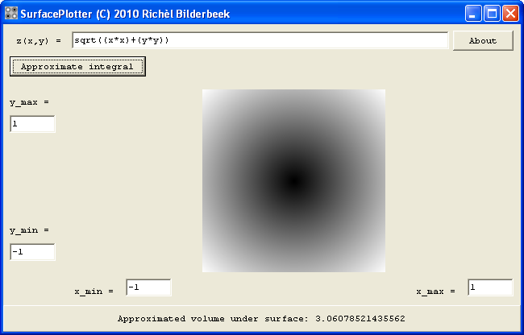
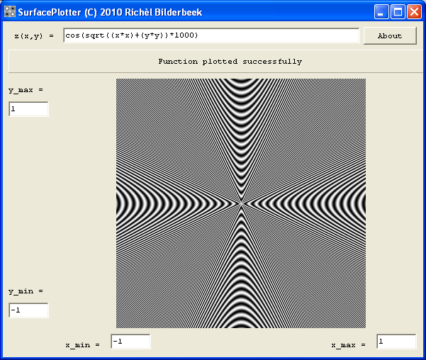
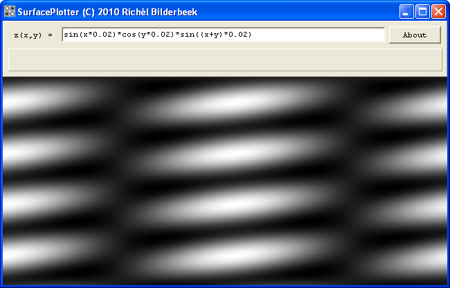

# SurfacePlotterVcl

Tool to do surface plotting using Warps function parser and the C++ VCL library.
 
[SurfacePlotter (VCL)](ToolSurfacePlotterVcl.htm) is a [tool](Tools.htm)
to make a surface plot and is the predecessor of
[SurfacePlotter](ToolSurfacePlotter.htm).

Note that this program uses [Warp's FunctionParser class](http://warp.povusers.org/FunctionParser) version 2.7, where the
current version (of February 2010) exceeds 4.0. This is due to
compilation problems under [C++
Builder](https://github.com/richelbilderbeek/cpp/blob/master/content/CppBuilder.md)
6.0. Small changes have been made to [Warp\'s FunctionParser
class](http://warp.povusers.org/FunctionParser) to get it to compile.

 * [Download the 'SurfacePlotter' Windows executable (v.1.1)(zip)](ToolSurfacePlotterExe_1_2.zip)

## External links

 * [Homepage of Warp's FunctionParser class](http://warp.povusers.org/FunctionParser)
